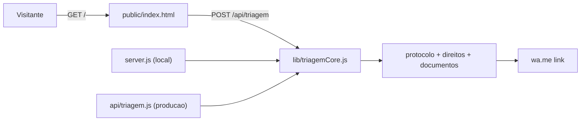

# Miller Costa Advogados & BAM Inteligência Jurídica

Portal institucional de alta conversão e triagem jurídica com inteligência artificial para o escritório Miller Costa Advogados Associados.

## Objetivo Estratégico

Este projeto resolve diretamente a necessidade comercial e de atendimento do escritório:

1. **Posicionamento de Autoridade**: Apresentação destacada das 4 frentes de atuação (Direito do Trabalho, Direito Previdenciário / INSS, Cível & Contratos e Consumidor) na Grande São Paulo.
2. **Triagem Preliminar com Inteligência Artificial**: O cliente em potencial descreve sua situação e recebe instantaneamente um diagnóstico preliminar com os direitos prováveis e documentos recomendados para separar.
3. **Transbordo Qualificado para o WhatsApp**: O visitante clica no botão e já abre o WhatsApp do Dr. Miller Costa com a demanda totalmente estruturada (protocolo, urgência, resumo fático e direitos pontuados), acelerando o fechamento do contrato de honorários.

## Arquitetura e Rotas



- `GET /`: Landing page pública de alta conversão com motor de triagem interativo.
- `GET /health`: Health check para orquestração e monitoramento em produção.
- `POST /api/triagem`: API de processamento com IA para classificação fática, análise de urgência e formatação de mensagem para WhatsApp.

## Execução Local

```bash
bin/setup      # Windows: bin/setup.ps1 (instala, valida tipos e roda testes)
npm run dev    # watch mode na porta 3000
```

Acesse `http://localhost:3000`.
